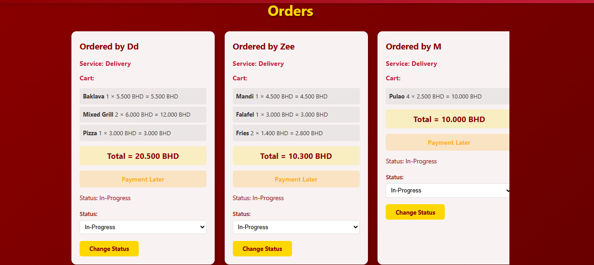
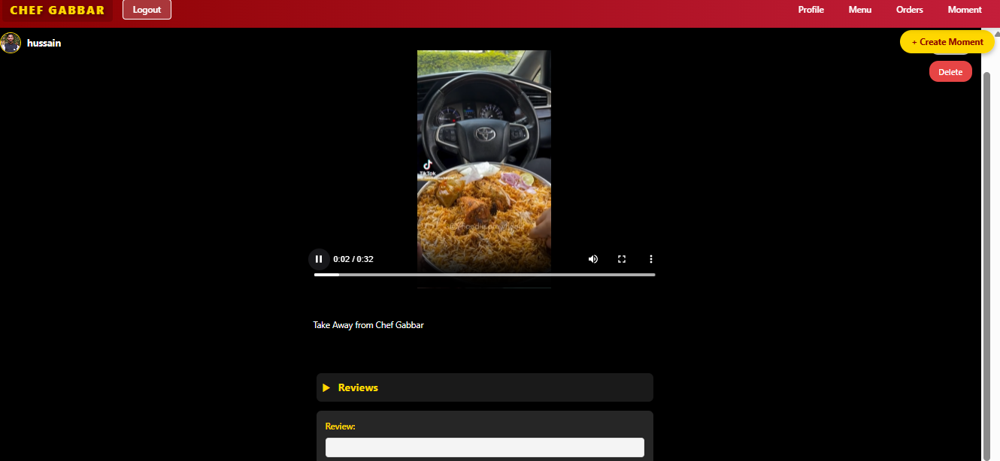

# 🍽️ Chef Gabbar: Where Every Bite Tells a Story!

Welcome to **Chef Gabbar**! 👨‍🍳✨ This isn't just another food app; it's your digital culinary sidekick! Whether you're craving a midnight feast 🌙, a quick grab-and-go 🏃‍♂️, or a cozy sit-down vibe 🍷, we’ve got the flavors to make your heart (and stomach) happy.

Our mission? To blend the **soul** of traditional cooking with the **speed** of modern tech. From smoky Mandi to the crunchiest Falafel, we’re bringing the kitchen straight to your fingertips! 📱🥘

Deployed at [Chef Gabbar](https://chefgabbar-vjdy.onrender.com)

---

## 🚀 Getting Started
Curious about the "Secret Sauce" behind our app? Dive into our blueprints and see how the magic happens! 🔍

* 📐 **The Architecture:** [Peek at our ERD](https://lucid.app/lucidchart/aab0347b-cb1d-4a92-afec-bb63e4ac6153/edit?view_items=._4otyTkbROA%2ChO4cGYu40Lz~%2C-U4c.53W_xNf%2ChO4cXgo6ivxc%2ChO4clz7A~m.v%2ChO4cjO.w7w3L%2C134cFy0ZNlOg%2C8J4oLeLXRS1H%2CT24cFMOl7xwO%2CQY4cRIuti9Tw%2CGZ4cJ2fVX7Ck%2CYc5oHkrA_nef%2C4c5o3WUNBUU~&page=0_0&invitationId=inv_78a95d3c-ec75-4ca3-a59b-32c7f33771cf)
* 🧠 **Brainstorming Hub:** [Follow our Trello Journey](https://trello.com/b/rFQjyqjc/chef-gabbar)
* 🎨 **The Look & Feel:** [Explore our Wireframes](https://www.figma.com/design/Lb2w5UzeZT1wHxbx4RCG7i/Untitled?node-id=0-1&t=pf6Fj8ZD67yQ3L04-1)

---

## 📸 A Taste of the App

### 1. The Welcome Mat 🏠
Our landing page is designed to make you hungry the second you arrive! It’s sleek, dark, and absolutely delicious.

### 2. Find Your Flavor 🔍🥗
Feeling picky? No problem! Our menu is organized by cuisine. Use the **Magic Search Bar** to hunt down your cravings in record time! ⚡

### 3. The Control Tower (Management) 🕹️📋
Behind the scenes, our managers are kitchen wizards! This dashboard tracks every order from the first "sizzle" to the final delivery. 🚛

### 4. Share the Vibe with "Moments" 🎥✨
Food is better with friends! Our **"Moments"** feature lets you upload Reels and videos of your feast. Watch, drool, and spread the love! 🎬❤️

---

## 🌟 Superpowers (Features)
* 🍲 **Cuisine Explorer:** From Arabic delights to Continental classics.
* 🚚 **Triple Threat:** Choose between **Dine-in, Takeaway, or Delivery**.
* 🔄 **Real-Time Tracking:** No more "Where's my food?" anxiety!
* 🎬 **Foodie Feed:** A social network built just for your meals.
* 🛡️ **Secure Checkout:** Your data is guarded tighter than a secret family recipe!

---

## 🧊 The Ice Box: Future Flavors! ❄️🚀
We’re constantly seasoning the app with fresh updates! Here is what’s simmering in our "Future Kitchen":

* 🪑 **Table Teleportation:** Selecting **Dine-in**? You’ll soon be able to pick your exact table from a live map. VIP seating, anyone? 😎
* 💬 **Owner Live-Chat:** Have a special request? Owners can now chat back in real-time to make sure your meal is exactly how you like it! 🗣️🤝
* 📍 **Pin-Point Delivery:** We're integrating **Google Maps** so you can drop a pin exactly where you're sitting. Whether you're at home or in the park, we'll find you! 🗺️📍
* 🎁 **Loyalty Loot:** Earn "Chef Coins" for every order and trade them for tasty rewards! 🪙🍕

---

## 🛠️ The Kitchen Sink (Tech Stack)
* **Brain:** Django 6.x 🐍
* **Memory:** PostgreSQL / SQLite 🗄️
* **Face:** HTML5, CSS3, & Django Templates 🎨
* **Vault:** Secure Payment APIs (Stripe/PayPal) 💳
* **Maps:** Google Maps Platform 🗺️
* **Real-Time:** Django Channels & WebSockets (for that snappy LiveChat!) ⚡

---
**Ready to start your food journey? Let's get cooking!** 👩‍🍳🔥🎉
